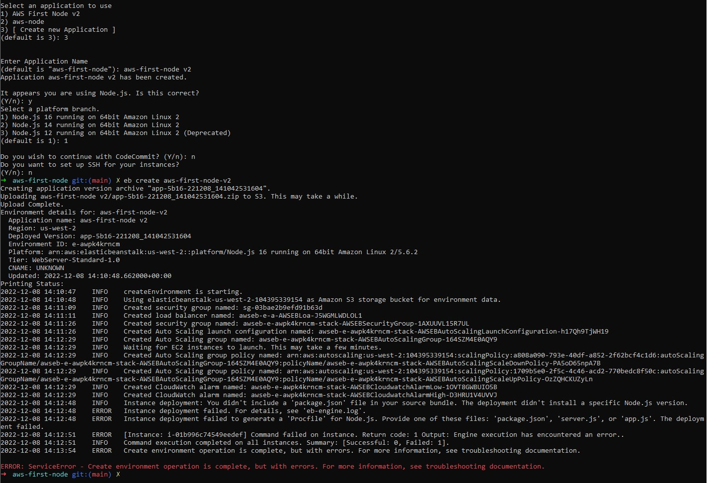

# Documentation

## GUI Deploy

### Steps:

- Create index.js and package.json files
- Zip those documents together
- Click <code> Create a new environment</code> on the AWS EB Environments page
- Select the create zip file
- Click create and wait!
- [GUI Deployed Link](AWS-first-deploy.eba-npvp6jaz.us-west-2.elasticbeanstalk.com)
</img>

## CLI Deploy

### Steps:

- In the terminal enter <code>eb init</code>
- Follow all the prompts given in the terminal
</img>
- Let the CLI create the new instance on AWS
- [CLI Deployed Link](http://aws-first-node-v2.eba-env2apws.us-west-2.elasticbeanstalk.com/)

There was an issue with my deploy, all steps were followed exactly. Looking to solve this issue at some other point in time.
</img>